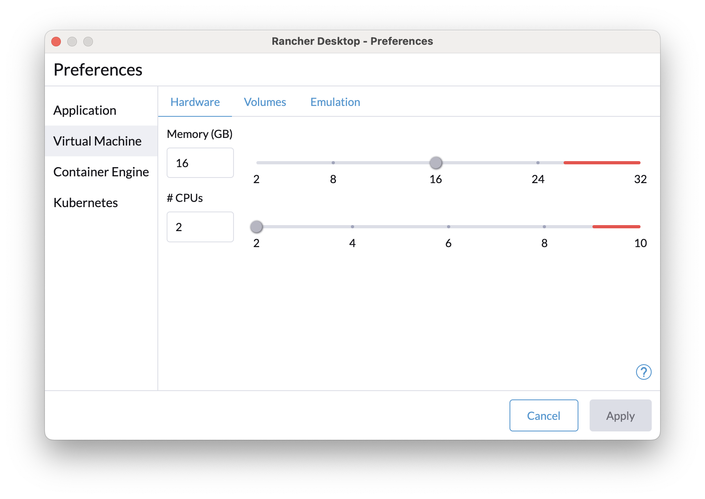
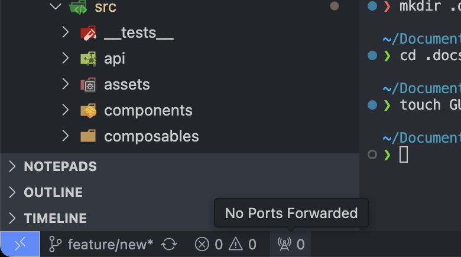

# Guide

> https://github.com/n8n-io/n8n/blob/master/CONTRIBUTING.md#development-setup

## Get Started

### 1. Git clone

- [ ] 개발 repository 생성

```bash
git clone ...
```

### 2. Requirements

- Node.js
- pnpm
- vscode

### 3. local 실행

docker compose 실행

```bash
docker compose up -d
```

<details>
<summary>devcontainer 사용 시</summary>

### 3-2. devcontainer 실행 (devcontainer 사용 시 필요)

> Cursor IDE에서는 devcontainer가 정상적으로 실행되지 않습니다.

vscode를 실행하여 다음 절차대로 진행합니다.

> [!Note]
> rancher desktop(그외 비슷한 프로그램)에서 container 메모리 사이즈를 넉넉하게 설정합니다.(권장 16GB이상)
> 

#### 3-0. plugin 설치

- devcontainer

#### 3-1. company.pem

사내 망에서는 SSL 인증을 위한 추가 절차가 필요합니다.

SSL 인증을 위해 받았던 company.pem 파일을 `.devcontainer` 파일 아래에 위치시킵니다.

```bash
total 16
drwxr-xr-x    6 node     node           192 Apr 21 04:49 .
drwxr-xr-x   43 node     node          1376 Apr 22 01:05 ..
-rw-r--r--    1 node     node           463 Apr 21 04:49 Dockerfile
-rw-r--r--    1 node     node          1562 Apr 21 02:30 company.pem
-rw-r--r--    1 node     node           693 Apr 21 04:30 devcontainer.json
-rw-r--r--    1 node     node           496 Apr 21 02:24 docker-compose.yml
/workspaces/.devcontainer $
```

#### 3-2. devcontainer 진입

vscode 왼쪽 하단 파란색 `><` 아이콘을 눌러 `Reopen container`를 누릅니다.
또는 <kbd>Ctrl</kbd> + <kbd>Shift</kbd> + <kbd>P</kbd>를 눌러 `Dev container: Reopen container`를 실행합니다.



#### 3-3. prepare

devcontainer 진입 시 postCreateCommand, preAttachCommand를 통해 `pnpm install`, `pnpm build`가 자동으로 실행됩니다.

devcontainer내에 vscode에 필요한 플러그인을 설치합니다.(`vue`, `biome`, ...등)

</details>

### 4. Installation

```bash
pnpm i
# SSL 에러 시
# NODE_EXTRA_CA_CERTS=company.pem pnpm install
```

### 5. .env

```bash
cp .env.example .env
```

### 6. build

```bash
pnpm build
```

### 7. Start

```bash
# localhost:5678
pnpm start
```

### 8. dev mode

hot reloading이 가능한 개발 모드

```bash
# localhost:8080
pnpm dev
```

## editor-ui i18n

> packages/frontend/editor-ui/src/plugins/i18n/docs/README.md

서비스 화면에 다국어처리를 위해 frontend/editor-ui에 i18n 파일을 추가합니다.

default 는 [en.json](../packages/frontend/editor-ui/src/plugins/i18n/locales/en.json) 입니다.
KR 다국어를 위해 [kr.json](../packages/frontend/editor-ui/src/plugins/i18n/locales/kr.json) 를 추가하여 사용합니다.


## Deployment

See [docker/images/n8n-bc/README.md](../docker/images/n8n-bc/README.md)
